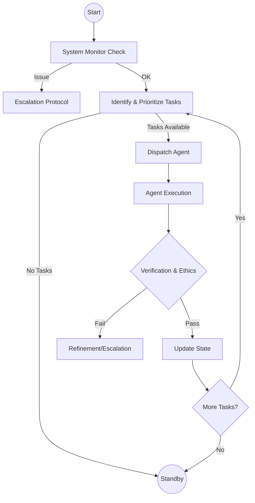

# High-Level Operational Workflows

⫻task/workflow:highlevel/001
## General Operational Cycle
**Description**: The core loop that drives the MultiPersona system, ensuring continuous task processing, state maintenance, and system integrity.

### Workflow Steps
1.  **Cycle Initialization**
    *   **Trigger**: Timer tick, User Input, or Event (e.g., Task Completion).
    *   **Action**: Orchestrator wakes and assesses current context.

2.  **System Observation (Monitor)**
    *   **Agent**: SystemMonitor
    *   **Action**: Scan for anomalies, check resource health, verify protocol adherence.
    *   **Decision**: If critical issue -> Trigger **Escalation Protocol**. Else -> Proceed.

3.  **Task Identification & Prioritization**
    *   **Agent**: Orchestrator
    *   **Action**:
        *   Fetch `pending` tasks from Task State.
        *   Filter tasks with satisfied dependencies.
        *   Sort by priority (High > Medium > Low) and creation time.
    *   **Output**: Ordered list of executable tasks.

4.  **Agent Dispatch**
    *   **Agent**: Orchestrator
    *   **Action**: Select highest priority task. Identify required Role. Assign task to Agent.
    *   **Protocol**: Send `⫻command/dispatch` message to Agent.

5.  **Task Execution**
    *   **Agent**: Assigned Agent (e.g., WePlan, Codein)
    *   **Action**: Perform the defined work. Generate artifacts or update state.
    *   **Constraint**: Adhere to Role Definition and System Prompts.

6.  **Verification & Ethics Check**
    *   **Agent**: Dima / SystemMonitor
    *   **Action**: Review output for ethical compliance (Beneficence, Non-maleficence) and structural validity (KickLang schema).
    *   **Decision**: If valid -> Proceed. If invalid -> Trigger **Refinement Loop** or **Escalation**.

7.  **State Update & Completion**
    *   **Agent**: Orchestrator
    *   **Action**: Mark task as `completed`. Update dependencies for downstream tasks.
    *   **Output**: Log completion via `⫻log/task-complete`.

8.  **Cycle Termination/Loop**
    *   **Action**: Check for more pending tasks.
    *   **Decision**: If tasks remain -> Return to Step 3. If idle -> Enter **Standby Mode**.

### Visual Representation (Mermaid)

